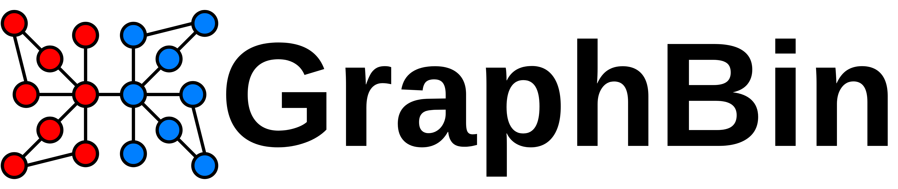
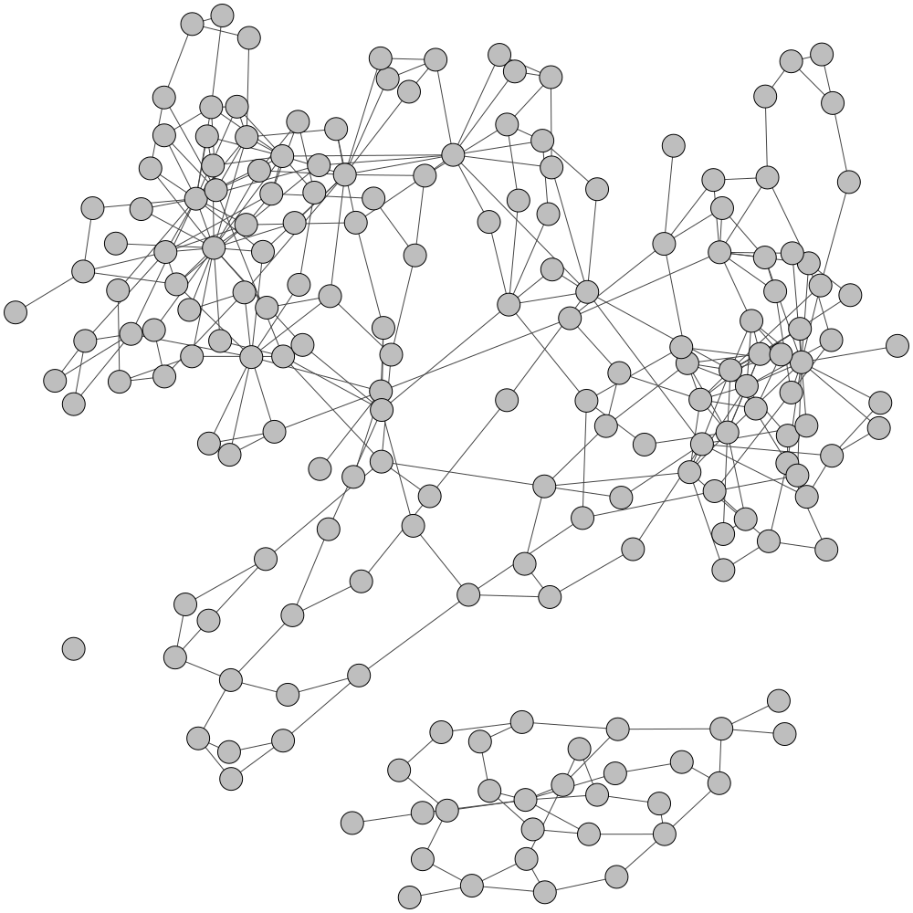
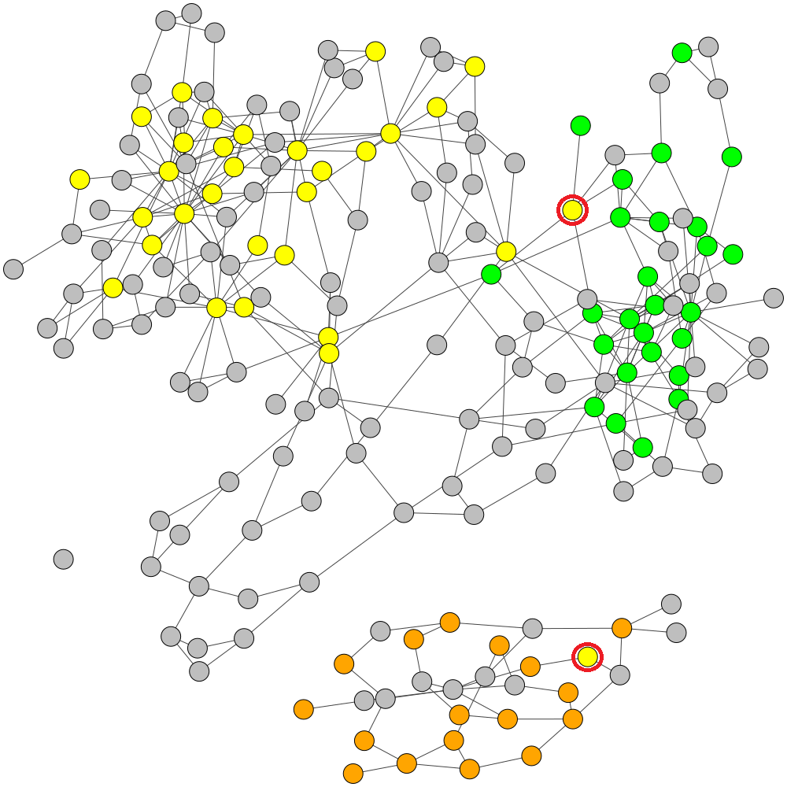
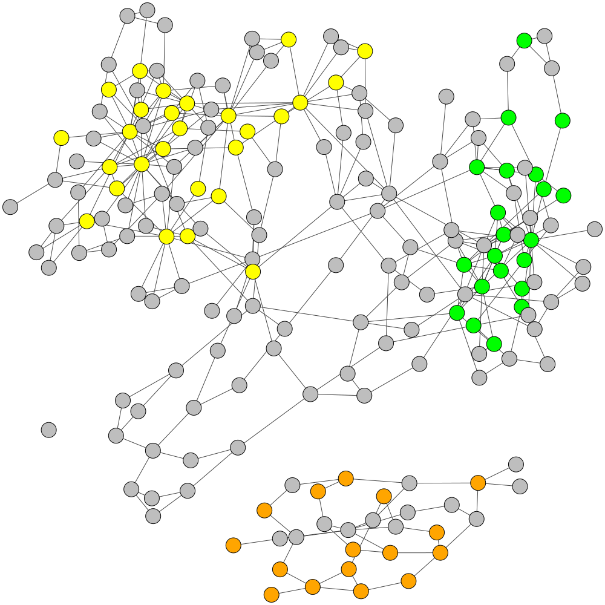
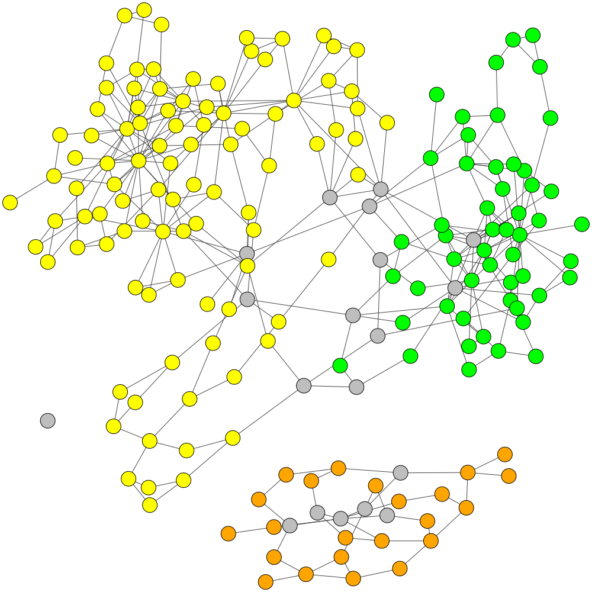

<p align="center">
  
</p>

# GraphBin: Refined Binning of Metagenomic Contigs using Assembly Graphs

 


**GraphBin** is a NGS data-based metagenomic contig bin refinment tool that makes use of the contig connectivity information from the assembly graph to bin contigs. It utilizes the binning result of an existing binning tool and a label propagation algorithm to correct mis-binned contigs and predict the labels of contigs which are discarded due to short length.

## Getting Started

### Downloading GraphBin
You can download the latest release of GraphBin from [Releases](https://github.com/Vini2/GraphBin/releases) or clone the GraphBin repository to your machine.

```
git clone https://github.com/Vini2/GraphBin.git
```

If you have downloaded a release, you will have to extract the files using the following command.

```
unzip [file_name].zip
```

Now go in to the GraphBin folder using the command

```
cd GraphBin/
```

### Dependencies

You will need the following dependencies to run GraphBin and related support scripts.
* [python-igraph](https://igraph.org/python/)
* [biopython](https://biopython.org/)
* [cairocffi](https://pypi.org/project/cairocffi/)

### Installing GraphBin

This installation requires python 3.6 or above with pip3. You can install GraphBin globally or per user depending on your privileges to the system.

#### Installing as admin
```
pip3 install .
```

#### Installing for the active user
```
pip3 install . --user
```

#### Note for Ubuntu users

If you come across an error as `Failed building wheel for python-igraph` when installing GraphBin, you can install python-igraph as shown in [this thread](https://stackoverflow.com/questions/34962410/igraph-failed-to-install-through-pip).

Now you are ready to run GraphBin.


## Assembly
The assembly of contigs can be done using 3 assembly software.

### metaSPAdes
[**SPAdes**](http://cab.spbu.ru/software/spades/) is an assembler based on the de Bruijn graph approach. [**metaSPAdes**](https://genome.cshlp.org/content/27/5/824) is the dedicated metagenomic assembler of SPAdes. Use metaSPAdes (SPAdes in metagenomics mode) software to assemble reads into contigs.

### SGA
[**SGA**](https://github.com/jts/sga) (String Graph Assembler) is an assembler based on the overlap-layout-consensus (more recently string graph) approach. Use SGA software to assemble reads into contigs.

### MEGAHIT

[**MEGAHIT**](https://github.com/voutcn/megahit) is an assembler based on the de Bruijn graph approach. Use MEGAHIT software to assemble reads into contigs.

Once you have obtained the assembly output, you can run GraphBin.

## Using GraphBin
You can see the usage options of GraphBin by typing ```graphbin -h``` on the command line. For example,

```
usage: graphbin [-h] [--version] [--graph GRAPH] [--binned BINNED] [--output OUTPUT] [--prefix PREFIX] [--max_iteration MAX_ITERATION] [--diff_threshold DIFF_THRESHOLD] [--assembler ASSEMBLER]
                [--paths PATHS] [--contigs CONTIGS]

GraphBin Help. GraphBin is a metagenomic contig binning tool that makes use of the contig connectivity information from the assembly graph to bin contigs. It utilizes the binning result of an
existing binning tool and a label propagation algorithm to correct mis-binned contigs and predict the labels of contigs which are discarded due to short length.

optional arguments:
  -h, --help            show this help message and exit
  --version
  --graph GRAPH         path to the assembly graph file
  --binned BINNED       path to the .csv file with the initial binning output from an existing tool
  --output OUTPUT       path to the output folder
  --prefix PREFIX       prefix for the output file
  --max_iteration MAX_ITERATION
                        maximum number of iterations for label propagation algorithm. [default: 100]
  --diff_threshold DIFF_THRESHOLD
                        difference threshold for label propagation algorithm. [default: 0.1]
  --assembler ASSEMBLER
                        name of the assembler used (SPAdes, SGA or MEGAHIT). GraphBin supports Flye, Canu and Miniasm long-read assemblies as well.
  --paths PATHS         path to the contigs.paths file, only needed for SPAdes
  --contigs CONTIGS     path to the final.contigs.fa file, only needed for MEGAHIT
```

`max_iteration` and `diff_threshold` parameters are set by default to `100` and `0.1` respectively. However, the user can specify them when running GraphBin.

## Input Format

For the SPAdes version, `graphbin.py` takes in 3 files as inputs (required).
* Assembly graph file (in `.gfa` format)
* Paths of contigs (in `.paths` format)
* Binning output from an existing tool (in `.csv` format)

For the SGA version, `graphbin.py` takes in 2 files as inputs (required).
* Assembly graph file (in `.asqg` format)
* Binning output from an existing tool (in `.csv` format)

For the MEGAHIT version, `graphbin.py`  takes in 2 files as inputs (required).
* Assembly graph file (in `.gfa` format. To convert fastg to gfa refer [here](https://github.com/Vini2/GraphBin/blob/master/support/README.md#fastg2gfa))
* Contigs file (in `.fa` format)
* Binning output from an existing tool (in `.csv` format)

**Note:** The binning output file should have comma separated values ```(contig_identifier, bin_number)``` for each contig. The contents of the binning output file should look similar to the example given below. Contigs are named according to their original identifier and the numbering of bins starts from 1.

Example metaSPAdes binned input
```
NODE_1,1
NODE_2,1
NODE_3,1
NODE_4,2
NODE_5,2
...
```
Example SGA binned input
```
contig-0,1
contig-1,2
contig-2,1
contig-3,1
contig-4,2
...
```
Example MEGAHIT binned input
```
k99_10059,1
k99_9367,1
k99_15595,2
k99_18709,1
k99_15596,2
...
```
GraphBin provides a support script to generate similar files once the initial binning output folder is provided. You can refer to [support/README.md](https://github.com/Vini2/GraphBin/blob/master/support/README.md) file for more details.

## Example Usage

```
graphbin --assembler spades --graph /path/to/graph_file.gfa --paths /path/to/paths_file.paths --binned /path/to/binning_result.csv --output /path/to/output_folder
```
```
graphbin --assembler sga --graph /path/to/graph_file.asqg --binned /path/to/binning_result.csv --output /path/to/output_folder
```
```
graphbin --assembler megahit --graph /path/to/graph_file.gfa --contigs /path/to/contigs.fa --binned /path/to/binning_result.csv --output /path/to/output_folder
```

## Support Scripts

GraphBin provides support scripts to format an initial binning result and visualise binning results in the assembly graph. Details about support scripts and how to execute them are provided in [support/README.md](https://github.com/Vini2/GraphBin/blob/master/support/README.md) file.

## Test Data

The data used to test GraphBin can be found in the `test_data` folder. The test data for each of the datasets include the following files.
* Contigs file
* Assembly graph file
* Paths file for the assembly graph (for the datasets assembled using metaSPAdes)
* Initial binning result from [MaxBin 2.0](https://sourceforge.net/projects/maxbin2/)
* Initial binning result from [MetaWatt](https://sourceforge.net/p/metawatt/wiki/Home/)
* Initial binning result from [MetaBAT 2](https://bitbucket.org/berkeleylab/metabat/src/master/)
* Initial binning result from [SolidBin](https://github.com/sufforest/SolidBin)
* Initial binning result from [BusyBee Web](https://ccb-microbe.cs.uni-saarland.de/busybee/) (Not available for metaSPAdes assemblies)
* Ground truth labelling of contigs from [TAXAassign](https://github.com/umerijaz/TAXAassign)

You can try running GraphBin using these test data files.

## Visualization of the Assembly Graph of ESC+metaSPAdes Test Dataset

### Initial Assembly Graph
<p align="center">
  
</p>

### TAXAassign Labelling
<p align="center">
  
</p>

### Original MaxBin Labelling with 2 Mis-binned Contigs
<p align="center">
  
</p>

### Refined Labels
<p align="center">
  
</p>

### Final Labelling of GraphBin
<p align="center">
  
</p>

## References
[1] Bankevich, A., _et al._: SPAdes: A New Genome Assembly Algorithm and Its Applications to Single-Cell Sequencing. Journal of Computational Biology 19(5), 455-477 (2012)

[2] Barnum, T.P., _et al._: Genome-resolved metagenomics identifies genetic mobility, metabolic interactions, and unexpected diversity in perchlorate-reducing communities. The ISME Journal 12, 1568-1581 (2018)

[3] Laczny, C. C., _et al._: BusyBee Web: metagenomic data analysisby bootstrapped supervised binning and annotation. Nucleic AcidsResearch 45(W1), W171–W179 (2017)

[4] Li, D. _et al._: MEGAHIT: an ultra-fast single-node solution for large and complex metagenomics assembly via succinct de Bruijn graph. Bioinformatics, 31(10), 1674–1676 (2015).

[5] Nurk, S., _et al._: metaSPAdes: a new versatile metagenomic assembler. Genome Researcg 5, 824-834 (2017)

[6] python-labelpropagation: Python implementation of label propagation, [https://github.com/ZwEin27/python-labelpropagation](https://github.com/ZwEin27/python-labelpropagation).

[7] Sczyrba, A., _et. al_: Critical Assessment of Metagenome Interpretation a Benchmark of Metagenomics Software. Nature Methods 14, 1063-1071 (2017)

[8] Simpson, J. T. and Durbin, R.: Efficient de novo assembly of large genomes using compressed data structures. Genome Research, 22(3), 549–556 (2012).

[9] Strous, M., _et al._: The Binning of Metagenomic Contigs for Microbial Physiology of Mixed Cultures. Frontiers in Microbiology 3, 410 (2012).

[10] Wang, Z., _et al._:  SolidBin: improving metagenome binning withsemi-supervised normalized cut. Bioinformatics 35(21), 4229–4238 (2019).

[11] Wu, Y.W., _et al._: MaxBin: an automated binning method to recover individual genomes from metagenomes using an expectation-maximization algorithm. Microbiome 2(1), 26 (2014)

[12] Wu, Y.W., _et al._: MaxBin 2.0: an automated binning algorithm to recover genomes from multiple metagenomic datasets. Bioinformatics 32(4), 605–607 (2016)

[13] Zhu, X., Ghahramani, Z.: Learning from Labeled and Unlabeled Data with Label Propagation. Technical report, School of ComputerScience, Carnegie Mellon University, (2002)

## Citation
If you use GraphBin in your work, please cite GraphBin as,

Vijini Mallawaarachchi, Anuradha Wickramarachchi, Yu Lin. GraphBin: Refined binning of metagenomic contigs using assembly graphs. Bioinformatics, Volume 36, Issue 11, June 2020, Pages 3307–3313, DOI: [10.1093/bioinformatics/btaa180](http://dx.doi.org/10.1093/bioinformatics/btaa180)

```
@article{10.1093/bioinformatics/btaa180,
    author = {Mallawaarachchi, Vijini and Wickramarachchi, Anuradha and Lin, Yu},
    title = "{GraphBin: refined binning of metagenomic contigs using assembly graphs}",
    journal = {Bioinformatics},
    volume = {36},
    number = {11},
    pages = {3307-3313},
    year = {2020},
    month = {03},
    abstract = "{The field of metagenomics has provided valuable insights into the structure, diversity and ecology within microbial communities. One key step in metagenomics analysis is to assemble reads into longer contigs which are then binned into groups of contigs that belong to different species present in the metagenomic sample. Binning of contigs plays an important role in metagenomics and most available binning algorithms bin contigs using genomic features such as oligonucleotide/k-mer composition and contig coverage. As metagenomic contigs are derived from the assembly process, they are output from the underlying assembly graph which contains valuable connectivity information between contigs that can be used for binning.We propose GraphBin, a new binning method that makes use of the assembly graph and applies a label propagation algorithm to refine the binning result of existing tools. We show that GraphBin can make use of the assembly graphs constructed from both the de Bruijn graph and the overlap-layout-consensus approach. Moreover, we demonstrate improved experimental results from GraphBin in terms of identifying mis-binned contigs and binning of contigs discarded by existing binning tools. To the best of our knowledge, this is the first time that the information from the assembly graph has been used in a tool for the binning of metagenomic contigs.The source code of GraphBin is available at https://github.com/Vini2/GraphBin.vijini.mallawaarachchi@anu.edu.au or yu.lin@anu.edu.auSupplementary data are available at Bioinformatics online.}",
    issn = {1367-4803},
    doi = {10.1093/bioinformatics/btaa180},
    url = {https://doi.org/10.1093/bioinformatics/btaa180},
    eprint = {https://academic.oup.com/bioinformatics/article-pdf/36/11/3307/33329097/btaa180.pdf},
}
```
