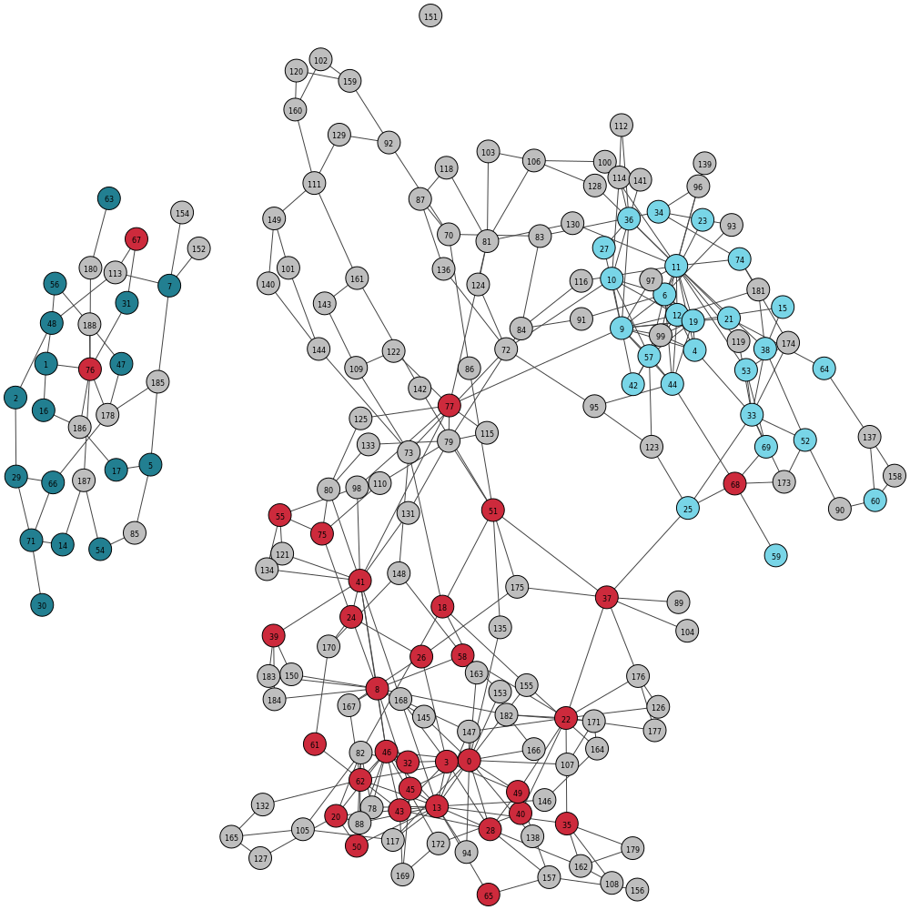

# Support scripts for GraphBin

GraphBin provides a set of support scripts on [GitHub](https://github.com/Vini2/GraphBin/tree/master/support). Details of these support scripts are as follows.

## prepResult.py

`prepResult.py` is a support script that allows you to format an initial binning result in to the .csv format with contig identifiers and bin ID. Contigs are named according to their original identifier and bins are numbered according to the fasta file name. You can run `prepResult.py` as follows.

```
python prepResult.py --binned /path/to/folder_with_binning_result --output /path/to/output_folder
```
You can see the usage options of `prepResult.py` by typing `python prepResult.py -h` on the command line.

Formatted binning result will be stored in a file named `initial_contig_bins.csv` in the output folder provided. Bin IDs and corresponding fasta files for each bin will be recorded in a file named `bin_ids.csv` in the output folder provided.

## Visualising Assemblies

`visualiseResult_SPAdes.py`, `visualiseResult_SGA.py`, `visualiseResult_MEGAHIT.py` and `visualiseResult_Flye_Canu_Miniasm.py` allows you to visualize the binning result by denoting coloured contigs in the assembly graph according to their corresponding bins. You can visualise the initial binning result obtained from an existing binning tool and the final binning result obtained from GraphBin and compare.

You can see the usage options by typing `python visualiseResult_SPAdes.py -h` or `python visualiseResult_SGA.py -h` or `python visualiseResult_MEGAHIT.py -h` or `python visualiseResult_Flye_Canu_Miniasm.py -h` on the command line.

```
usage: visualiseResult_SPAdes.py [-h] --initial INITIAL --final FINAL --graph
                                 GRAPH --paths PATHS --output OUTPUT
                                 [--prefix PREFIX] [--type TYPE]
                                 [--width WIDTH] [--height HEIGHT]
                                 [--vsize VSIZE] [--lsize LSIZE]
                                 [--margin MARGIN] [--dpi DPI]

optional arguments:
  -h, --help         show this help message and exit
  --initial INITIAL  path to the file containing the initial binning result
                     from an existing tool
  --final FINAL      path to the file containing the final GraphBin binning
                     result
  --graph GRAPH      path to the assembly graph file
  --paths PATHS      path to the contigs.paths file
  --output OUTPUT    path to the output folder
  --prefix PREFIX    prefix for the output image files
  --type TYPE        type of the image (jpg, png, eps, svg)
  --width WIDTH      width of the image in pixels
  --height HEIGHT    height of the image in pixels
  --vsize VSIZE      size of the vertices
  --lsize LSIZE      size of the vertex labels
  --margin MARGIN    margin of the figure
  --dpi DPI          dpi value

```
```
usage: visualiseResult_SGA.py [-h] --initial INITIAL --final FINAL --graph
                              GRAPH --output OUTPUT [--prefix PREFIX]
                              [--type TYPE] [--width WIDTH] [--height HEIGHT]
                              [--vsize VSIZE] [--lsize LSIZE]
                              [--margin MARGIN] [--dpi DPI]

optional arguments:
  -h, --help         show this help message and exit
  --initial INITIAL  path to the file containing the initial binning result
                     from an existing tool
  --final FINAL      path to the file containing the final GraphBin binning
                     result
  --graph GRAPH      path to the assembly graph file
  --output OUTPUT    path to the output folder
  --prefix PREFIX    prefix for the output image files
  --type TYPE        type of the image (jpg, png, eps, svg)
  --width WIDTH      width of the image in pixels
  --height HEIGHT    height of the image in pixels
  --vsize VSIZE      size of the vertices
  --lsize LSIZE      size of the vertex labels
  --margin MARGIN    margin of the figure
  --dpi DPI          dpi value
```
```
usage: visualiseResult_MEGAHIT.py [-h] --initial INITIAL --final FINAL --graph
                                  GRAPH --output OUTPUT [--prefix PREFIX]
                                  [--type TYPE] [--width WIDTH]
                                  [--height HEIGHT] [--vsize VSIZE]
                                  [--lsize LSIZE] [--margin MARGIN]
                                  [--dpi DPI]

optional arguments:
  -h, --help         show this help message and exit
  --initial INITIAL  path to the file containing the initial binning result
                     from an existing tool
  --final FINAL      path to the file containing the final GraphBin binning
                     result
  --graph GRAPH      path to the assembly graph file
  --output OUTPUT    path to the output folder
  --prefix PREFIX    prefix for the output image files
  --type TYPE        type of the image (jpg, png, eps, svg)
  --width WIDTH      width of the image in pixels
  --height HEIGHT    height of the image in pixels
  --vsize VSIZE      size of the vertices
  --lsize LSIZE      size of the vertex labels
  --margin MARGIN    margin of the figure
  --dpi DPI          dpi value
```

### Original MaxBin Labelling of the ESC+SPAdes dataset



### Final Labelling of the of the ESC+SPAdes dataset produced from GraphBin


## Before using Miniasm assemblies
Please note that, if you are using Miniasm assemblies, you should provide the edge sequences for the initial binning tool (not the contigs output from Miniasm). To get the edge sequences from the GFA file, you can use [this script](https://github.com/Vini2/GraphBin/blob/master/support/miniasm_gfa2fasta.py) as the assembly graph consists of these edge sequences and not contigs.

If you come across a Python3 error when plotting graphs, please refer to [this thread](https://github.com/igraph/python-igraph/issues/88) to fix it.

## fastg2gfa

The MEGAHIT toolkit will result in a FASTG file which you can convert to GFA using [fastg2gfa](https://github.com/lh3/gfa1/blob/master/misc/fastg2gfa.c).

```
fastg2gfa final.fastg > final.gfa
```
