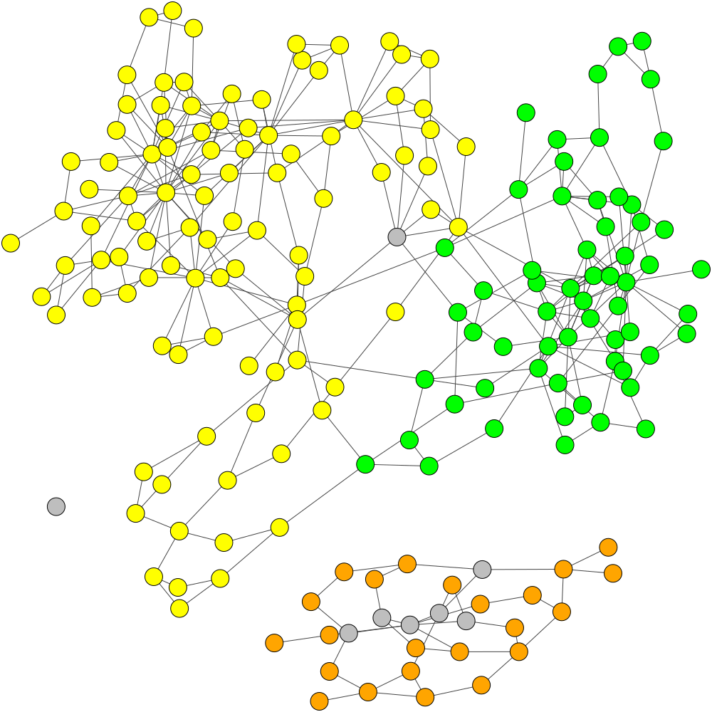

# Running GraphBin on Test Data

## Test Data

The simple datasets used to test GraphBin can be found in the `test_data` folder. The test data for each of the datasets include the following files.

* Contigs file
* Assembly graph file
* Paths file for the assembly graph (for the datasets assembled using metaSPAdes)
* Initial binning result from [MaxBin 2.0](https://sourceforge.net/projects/maxbin2/)
* Initial binning result from [MetaWatt](https://sourceforge.net/p/metawatt/wiki/Home/)
* Initial binning result from [MetaBAT 2](https://bitbucket.org/berkeleylab/metabat/src/master/)
* Initial binning result from [SolidBin](https://github.com/sufforest/SolidBin)
* Initial binning result from [BusyBee Web](https://ccb-microbe.cs.uni-saarland.de/busybee/) (Not available for metaSPAdes assemblies)
* Ground truth labelling of contigs from [TAXAassign](https://github.com/umerijaz/TAXAassign)

You can try running GraphBin using these test data files.

## Visualization of ESC+metaSPAdes Test Dataset

### Initial Assembly Graph

### TAXAassign Labelling

### Original MaxBin Labelling

### Refined Labels

### Final Labelling of GraphBin

