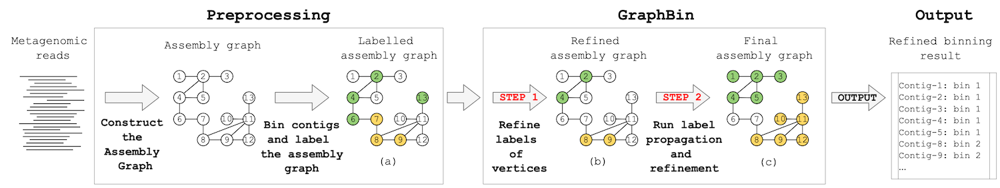

# GraphBin Workflow

During the pre-processing step, we obtain the assembly graph by assembling reads into contigs. This can be done by a metagenomic assembler such as metaSPAdes or MEGAHIT.

Then we bin the contigs and label the assembly graph. The binning can be done using an existing metagenomic binning tool such as MaxBin 2.0, MetaWatt, MetaBAT2, SolidBin or VAMB.

Next, GraphBin refines the labels of the assembly graph. Then, GraphBin adopts the label propagation algorithm proposed by [Zhu and Ghahramani](http://mlg.eng.cam.ac.uk/zoubin/papers/CMU-CALD-02-107.pdf) to determine the labels of the unlabelled contigs of the assembly graph.

At last, a refinement step is done to obtain the final graph. GraphBin outputs the refined binning result.

Please refer to the [original publication](https://doi.org/10.1093/bioinformatics/btaa180) for further details on the GraphBin Workflow.