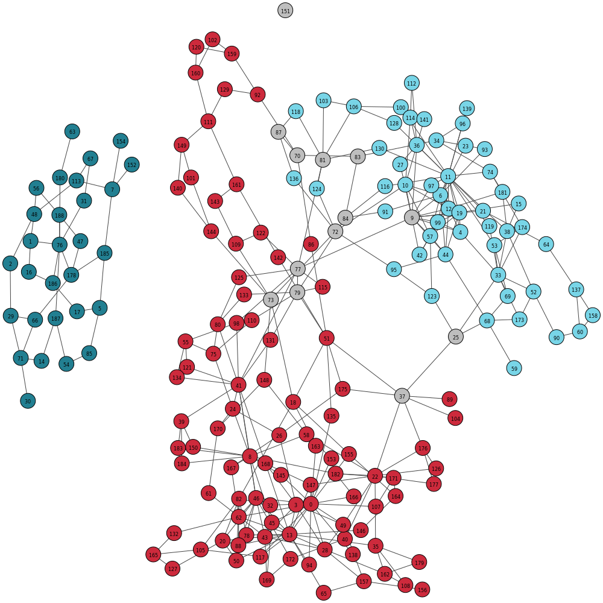

# Support scripts for GraphBin

## prepResult.py

`prepResult.py` is a support script that allows you to format an initial binning result in to the .csv format with contig identifiers and bin ID. Contigs are named according to their original identifier and bins are numbered starting from 1. You can run `prepResult.py` as follows.

```
python3 prepResult.py --binned /path/to/folder_with_binning_result --assembler assembler_type_(SPAdes/SGA) --output /path/to/output_folder
```
You can see the usage options of `prepResult.py` by typing `python3 prepResult.py -h` on the command line.

Formatted binning result will be stored in a file named `initial_contig_bins.csv` in the output folder provided. Bin IDs and corresponding fasta files for each bin will be recorded in a file named `bin_ids.csv` in the output folder provided.

## visualiseResult_SPAdes.py & visualiseResult_SGA.py

`visualiseResult_SPAdes.py` and `visualiseResult_SGA.py` allows you to visualize the binning result by denoting coloured contigs in the assembly graph according to their corresponding bins. You can visualise the initial binning result obtained from an existing binning tool and the final binning result obtained from GraphBin and compare.

You can see the usage options by typing `python3 visualiseResult_SPAdes.py -h` or `python3 visualiseResult_SGA.py -h` on the command line.

### Original MaxBin Labelling of the ESC+SPAdes dataset
<p align="center">
  
</p>

### Final Labelling of the of the ESC+SPAdes dataset produced from GraphBin
<p align="center">
  
</p>

## fastg2gfa

The MEGAHIT toolkit will result in a FASTG file which you can convert to GFA using [fastg2gfa](https://github.com/lh3/gfa1/blob/master/misc/fastg2gfa.c).
